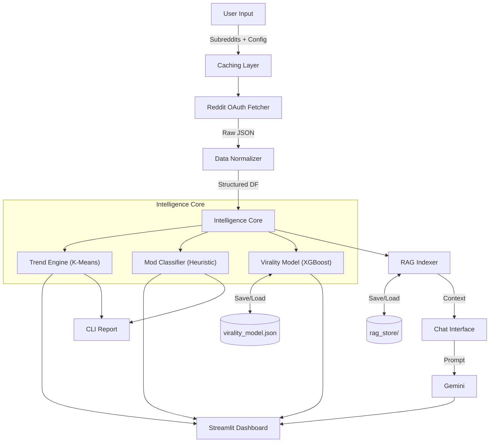

# SubSense: GenAI Reddit Intelligence System

Design notes and product rationale. For setup and usage, see [README.md](README.md).

---

## Product Vision

### The Problem

Traditional social listening tools are:

- **Static**: relying on simple keyword counting.
- **Transient**: insights are lost once the session ends.
- **Shallow**: unable to parse context or the factors behind "virality".

### The SubSense Solution

SubSense is a dynamic intelligence engine. Plug in any combination of
subreddits (e.g. `r/startups` + `r/AI_India`) and it produces a strategic
report: it surfaces topics, flags moderation risk, estimates reach, and answers
questions — while persisting what it learned between sessions.

---

## Core Intelligence Layers

The system is built as a "ladder of intelligence", each rung a pure
DataFrame-in / DataFrame-out transform.

### 1. Universal Data Fetcher

- **Auth**: Reddit application-only OAuth (client credentials). The anonymous
  `.json` endpoints now answer 403, so credentials are required.
- **Resilience**: retry with backoff on 429/5xx, token refresh on 401, and a
  cursor-repeat guard so pagination cannot spin.
- **Universal normalization**: chaotic Reddit JSON becomes one fixed schema
  (`POST_COLUMNS`) with stable dtypes, so an empty result set is still a
  well-formed frame rather than a crash downstream.
- **Caching**: the dashboard memoises fetches with a TTL to respect rate limits.

### 2. Trend Engine (Unsupervised ML)

- **Algorithm**: TF-IDF vectorization + K-Means clustering.
- **Reproducibility**: seeded, with a fresh vectorizer per run, so the same
  corpus maps to the same topics on every run.
- **Goal**: group hundreds of posts into coherent topics ("hiring trends",
  "LLM fatigue") without a labelled dataset.

### 3. Mod & Risk Classifier (Heuristic Engine)

- **Algorithm**: rule-based heuristics + TextBlob sentiment polarity.
- **Signals**: locked threads (excluding stickied mod announcements), upvote
  ratios below 60%, and negative sentiment.
- **Explainability**: every score ships with the `risk_reasons` that produced
  it, so a flag is never a black box.

### 4. Virality Simulator (Persistent ML)

- **Algorithm**: XGBoost regressor, serialized to `virality_model.json`.
- **Features**: title length, word count, media flag, posting hour, day of
  week — all knowable *before* publishing, which is what makes the what-if
  sandbox meaningful.
- **MLOps**: training is decoupled from inference. A persisted model whose
  feature set no longer matches the engine is rejected with a warning and
  retrained, rather than failing on every prediction.

### 5. RAG Knowledge Store (GenAI + Vector Search)

- **Algorithm**: Gemini `text-embedding-004` → FAISS (or numpy) cosine search →
  Gemini chat model for the answer.
- **Consistency**: embeddings are L2-normalised so the FAISS and numpy paths
  return identical neighbours.
- **Persistence**: documents and embeddings are serialized to `rag_store/`,
  giving the assistant memory across restarts.
- **Smart indexing**: rate-limited batching, plus a fingerprint over post ids so
  re-analysing the same corpus does not re-spend embedding quota.

---

## Production Engineering

- **Config as code**: every tunable — model names, endpoints, batch sizes, risk
  weights — lives in `config.py`, read from the environment. No secrets and no
  machine-specific paths in the source.
- **Model registry**: models and indexes are serialized locally and gitignored;
  no scraped data or derived artifact is committed.
- **Error boundaries**: network, API and rendering failures degrade to a
  message rather than a stack trace, and carry an actionable next step.
- **Testable core**: HTTP and the LLM sit behind injectable seams, so the whole
  engine is covered by an offline test suite.

---

## Technical Stack

- **Frontend**: Streamlit, custom dark-mode UI.
- **LLM & AI**: Google Gemini (chat + `text-embedding-004`), both configurable.
- **Machine Learning**: `scikit-learn` (clustering), `xgboost` (regression),
  `TextBlob` (sentiment).
- **Vector search**: FAISS, with a numpy fallback.
- **Config**: `python-dotenv`.

---

## Application Architecture

---

Built by Sarthak Doshi. Targeting market researchers, DevRel teams and content
creators.
